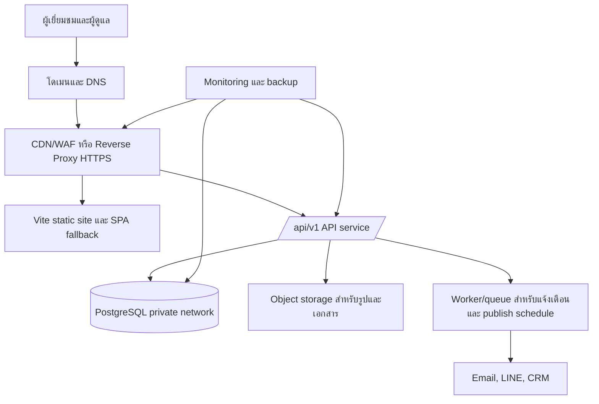
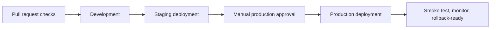

# แผนย้ายจาก Mock Data ไปยัง Backend จริง

เอกสารนี้เป็นแผนดำเนินงานสำหรับเปลี่ยนเว็บไซต์ YAKYAI 2015 จาก React/Vite
ที่ใช้ข้อมูล mock และ CMS prototype ใน browser ไปเป็นเว็บไซต์ production ที่มี
API, ฐานข้อมูล, ระบบผู้ดูแล และการ deploy บน VM จริง

เอกสารที่ต้องใช้ประกอบ:

- [ARCHITECTURE.md](ARCHITECTURE.md) — โครงสร้าง frontend และแนวทาง refactor
- [BACKEND_API_CONTRACT.md](BACKEND_API_CONTRACT.md) — API ที่เสนอไว้ (ยังไม่ใช่ contract สุดท้าย)
- [PRODUCTION_READINESS.md](PRODUCTION_READINESS.md) — ข้อกำหนดความปลอดภัยและ release gate
- [data.md](data.md) — เนื้อหาและขอบเขตเว็บไซต์ปัจจุบัน

> ห้ามลบ `src/data/` หรือข้อมูล mock ทันที การลบจะทำหลังจากนำเข้าข้อมูลจริง,
> เปลี่ยน frontend ให้เรียก API และตรวจสอบความถูกต้องใน staging ครบแล้วเท่านั้น

---

## 1. เป้าหมายและขอบเขต

### เป้าหมาย

1. เผยแพร่เว็บไซต์ public บนโดเมนจริงผ่าน HTTPS
2. ให้สินค้า ผลงาน ข่าว และเอกสารอ่านจากฐานข้อมูล โดยแสดงเฉพาะรายการที่เผยแพร่แล้ว
3. รับข้อมูลจากฟอร์มติดต่อและใบเสนอราคาอย่างปลอดภัย พร้อมบันทึกและแจ้งทีมงาน
4. สร้าง `/admin` ที่ยืนยันตัวตนและกำหนดสิทธิ์จาก server จริง
5. อัปโหลดรูปและเอกสารผ่าน storage ที่ปลอดภัย ไม่เก็บไฟล์ไว้ใน web root ของ VM
6. มี backup, monitoring, audit log, staging และขั้นตอน rollback ก่อนเปิด production

### นอกขอบเขตของ release แรก

- ระบบบัญชีลูกค้า/สมาชิก
- ระบบชำระเงิน
- หลายภาษา (เริ่มด้วย `th-TH`; ออกแบบ schema ให้ขยายได้ภายหลัง)
- Analytics dashboard แบบ realtime ใน CMS
- การ publish เนื้อหาด้วย AI โดยอัตโนมัติ

---

## 2. สถานะปัจจุบันและช่องว่างที่ต้องปิด

| ส่วน | สถานะปัจจุบัน | เป้าหมาย |
| --- | --- | --- |
| ข้อมูล public | `src/data/siteContent.ts` และ `src/data/downloads.ts` | PostgreSQL ผ่าน public API |
| ฟอร์ม | มี UI และ client validation | แยก contact/quote API พร้อม CAPTCHA, rate limit และการแจ้งเตือน |
| Admin | ถูกปิดแล้ว; prototype เป็น local state | Server session + RBAC + persistence + audit |
| Upload | ยังไม่มี flow จริง | Signed upload URL, ตรวจไฟล์, scan และเก็บ object storage |
| Deploy | Vite build ผ่าน; ยังไม่มี CI/backend | Docker + reverse proxy + CI/CD + staging/production |
| API contract | เป็นข้อเสนอ | OpenAPI 3.1 ที่ตกลงและทดสอบได้ |
| SEO | เปิด index และ metadata พื้นฐานแล้ว | canonical domain, sitemap, Search Console หลัง deploy |

ประเด็นที่ต้องแก้ระหว่าง integration:

- UI ปัจจุบันส่ง contact และ quote ไป `VITE_CONTACT_ENDPOINT` เดียว แต่ contract เสนอ
  endpoint แยกกัน (`/public/leads/contact` และ `/public/leads/quote`)
- field ของ quote ใน UI (`system`, `factory`, `detail`) ยังไม่ตรง field ที่เสนอใน contract
  (`productSlug`, `projectType`, `capacityRequirement`, `province`)
- ชนิดข้อมูล mock กับ API มีชื่อ field ต่างกัน เช่น `name`/`desc` กับ
  `title`/`description`; ต้องสร้าง adapter ไม่ให้ UI ผูกกับ response ดิบ
- `VITE_*` เป็นข้อมูล public ใน browser เท่านั้น ห้ามใส่ password, database URL,
  SMTP key, API key, webhook secret หรือ token ใด ๆ

---

## 3. สถาปัตยกรรมที่แนะนำ

ใช้ **โดเมนเดียว (same origin)** ใน release แรก เช่น `https://www.example.com`.
Frontend จะเรียก API แบบ relative path `/api/v1/...` ซึ่งตรงกับ CSP และ fetch policy
ปัจจุบัน ลดภาระ CORS และทำให้ cookie session ปลอดภัยกว่า API ที่แยกโดเมน



### 3.1 Stack ที่แนะนำ

| ชั้นระบบ | ทางเลือกที่แนะนำ | เหตุผล |
| --- | --- | --- |
| Frontend | React/Vite เดิม | ลดการ rewrite และใช้ UI ปัจจุบันต่อได้ |
| API | Node.js TypeScript + Fastify หรือ NestJS | ทีมใช้ TypeScript อยู่แล้ว, validation และ OpenAPI ทำได้ดี |
| Validation | Zod หรือ JSON Schema | บังคับ schema ทั้ง request/response และสร้าง contract test ได้ |
| Database | PostgreSQL | รองรับ relation, transaction, audit, full-text search และ migration |
| ORM/migration | Prisma, Drizzle หรือ Kysely + migration | ต้องมี migration ที่ versioned และ review ได้ |
| Reverse proxy | Caddy หรือ Nginx | TLS, static assets, API routing, security headers และ SPA fallback |
| Process/deploy | Docker Compose บน VM ในระยะแรก | ทำซ้ำง่าย, แยก service ชัดเจน, ย้ายไป managed/container platform ได้ภายหลัง |
| Media | S3-compatible object storage | ไม่วางรูป/PDF ที่อัปโหลดใน VM และรองรับ signed URL/backup |
| Bot protection | Cloudflare Turnstile หรือเทียบเท่า | ป้องกัน spam ฟอร์มโดยตรวจ token ที่ server |
| Monitoring | Uptime monitor + structured logs + error tracking | เห็น downtime, error, abuse และงาน worker ที่ค้าง |

> เลือก framework API และ provider ให้จบใน Phase 0 ก่อนเริ่มเขียน schema
> เพื่อไม่ให้ต้องเปลี่ยนโครงสร้างกลางทาง

### 3.2 การ route บน reverse proxy

ลำดับ route ต้องเป็นดังนี้:

1. `/api/v1/*` ส่งต่อไป API service
2. ไฟล์ static ที่มีอยู่จริงส่งจาก Vite build
3. public routes เช่น `/about`, `/products/:slug`, `/news/:slug` fallback ไป `index.html`
4. `/admin` ให้ SPA แสดงเฉพาะหลัง API ยืนยัน session; server ห้ามส่งข้อมูล admin
   โดยไม่ผ่าน authorization

ตัวอย่างแนวคิด:

```text
https://www.example.com/api/v1/*  -> api:3000
https://www.example.com/assets/*  -> static assets
https://www.example.com/*         -> /index.html (SPA fallback)
```

---

## 4. สิ่งที่ต้องตัดสินใจก่อนเริ่ม (Phase 0)

ให้มีผู้รับผิดชอบและบันทึกคำตอบสำหรับหัวข้อต่อไปนี้ก่อนพัฒนา backend:

### 4.1 Domain, DNS และ environment

- [ ] โดเมนหลัก เช่น `www.example.com` และ redirect ระหว่าง `www`/non-`www`
- [ ] subdomain staging เช่น `staging.example.com`
- [ ] DNS provider และผู้มีสิทธิ์แก้ DNS
- [ ] VM public IP, ระบบปฏิบัติการ, provider และสิทธิ์ console recovery
- [ ] ผู้รับผิดชอบ certificate renewal และ billing
- [ ] URL ที่จะใช้ใน Search Console และ sitemap

### 4.2 Business และเนื้อหา

- [ ] ยืนยันเนื้อหาที่อนุมัติให้เผยแพร่จริง ไม่ใช้ชื่อโครงการ/ลูกค้า/รูปที่ไม่มีสิทธิ์
- [ ] รายการข้อมูลที่ต้องแก้จาก CMS: สินค้า, ผลงาน, ข่าว, ดาวน์โหลด, homepage settings
- [ ] รูปแบบเนื้อหาบทความ: **Markdown แนะนำ**; ถ้าใช้ HTML ต้องมี sanitization policy
- [ ] สถานะเนื้อหา: `draft`, `scheduled`, `published`, `archived`
- [ ] timezone สำหรับกำหนดเวลาเผยแพร่: เก็บ UTC, แสดง `Asia/Bangkok`
- [ ] retention และผู้มีสิทธิ์เข้าถึงข้อมูล lead ตาม PDPA/นโยบายบริษัท

### 4.3 การปฏิบัติการ

- [ ] ผู้ดูแลระบบคนแรก, editor และ sales พร้อม role
- [ ] ต้องการ MFA แบบ TOTP หรือ WebAuthn สำหรับ admin
- [ ] ผู้ให้บริการอีเมล/CRM/LINE notification และผู้รับ notification
- [ ] ผู้ให้บริการ object storage และขนาดไฟล์สูงสุดสำหรับรูป/PDF
- [ ] เป้าหมาย recovery เริ่มต้น: RPO ไม่เกิน 24 ชั่วโมง, RTO ไม่เกิน 4 ชั่วโมง

### 4.4 API contract

แปลง [BACKEND_API_CONTRACT.md](BACKEND_API_CONTRACT.md) เป็น **OpenAPI 3.1** ที่เป็น
source of truth ก่อนเขียน frontend adapter โดยต้องระบุ:

- ทุก endpoint, request/response schema, example และ error code
- pagination, filters, sorting, maximum page size และ ETag
- authentication, cookie attributes, CSRF transport และ session lifetime
- schema แยกของ contact/quote รวมถึง required field และ `Idempotency-Key`
- allowed upload MIME type, file size, image dimensions และ lifecycle scan
- content fields ที่ admin รองรับจริง; อย่านำ field mock ทั้งหมดเข้าระบบโดยไม่จำเป็น

**Exit gate ของ Phase 0:** เจ้าของงาน frontend, backend และ content เห็นชอบ
OpenAPI, provider และขอบเขตของ release แรกแล้ว

---

## 5. Phase 1 — สร้าง staging และ VM foundation ที่ปลอดภัย

### งานที่ต้องทำ

1. สร้าง environment แยกอย่างน้อย `staging` และ `production`
2. ตั้ง DNS staging ก่อน แล้วออก TLS certificate ด้วย Let's Encrypt หรือ provider
3. ติดตั้ง Docker Engine/Compose, reverse proxy, API placeholder และ static frontend
4. สร้าง PostgreSQL ที่ **ไม่เปิด public port**
   - แนะนำ managed PostgreSQL หรือ VM/database private network แยกจาก public web VM
   - ถ้าจำเป็นต้องอยู่ VM เดียวกัน ให้ bind database เฉพาะ localhost/private interface
5. ใช้ object storage แยกจาก filesystem ของ web server
6. สร้าง secret storage บน VM/CI ที่ไม่อยู่ใน Git
7. ตั้ง backup database รายวัน, encryption และทดสอบ restore ไป staging
8. ตั้ง health endpoints:
   - `GET /health/live` — process ทำงาน
   - `GET /health/ready` — database/queue dependency พร้อม
9. ตั้ง monitoring สำหรับ HTTPS, disk, CPU, memory, backup failure, TLS expiry และ API 5xx

### VM hardening checklist

- [ ] สร้าง non-root deploy user; ปิด password SSH; ใช้ key หรือ short-lived certificate
- [ ] จำกัด SSH ด้วย VPN, bastion หรือ fixed IP ของผู้ดูแล
- [ ] firewall เปิดเฉพาะ `80`, `443` และ SSH ที่จำกัด source แล้ว
- [ ] redirect HTTP ไป HTTPS
- [ ] เปิด automatic security updates ของ OS
- [ ] service/container ทำงานเป็น non-root และใช้ read-only filesystem เท่าที่ทำได้
- [ ] ห้ามเปิด PostgreSQL, Redis หรือ object storage ออก Internet
- [ ] ใช้ security headers ที่ reverse proxy: HSTS หลังยืนยัน HTTPS, CSP,
      `X-Content-Type-Options`, `Referrer-Policy`, `Permissions-Policy`
- [ ] log ต้องไม่บันทึก password, cookie, authorization header, token, อีเมล หรือเบอร์โทรเต็มรูปแบบ

### Environment variables

| ตำแหน่ง | อนุญาตให้เก็บ | ห้ามเก็บ |
| --- | --- | --- |
| Frontend `VITE_*` | relative API path, public video URL, public site URL | token, secret, private API key, database URL |
| API runtime/secret store | database credential, cookie signing key, CAPTCHA secret, SMTP/CRM credential, storage key | ค่า secret ใน source code หรือ browser bundle |
| CI secret store | deploy key/token แบบจำกัดสิทธิ์, registry credential | secret ใน GitHub Actions log หรือ `.env` ที่ commit |

**Exit gate ของ Phase 1:** deploy staging จาก artifact ใหม่ได้, HTTPS/health check ผ่าน,
backup restore สำเร็จ และไม่มี secret ใน Git, browser bundle หรือ log

---

## 6. Phase 2 — Database, content API และการนำเข้าข้อมูล

### 6.1 ตารางหลักที่ต้องมี

| กลุ่ม | ตาราง/ข้อมูลอย่างน้อย |
| --- | --- |
| ผู้ใช้และสิทธิ์ | `users`, `roles`, `user_roles`, `sessions`, MFA factors, password reset records |
| เนื้อหา | `products`, `projects`, `articles`, `downloads`, `site_settings` (เฉพาะสิ่งที่ต้องแก้ผ่าน CMS) |
| Media | `media_assets`, `project_media` พร้อม checksum, MIME, scan status, alt, caption, sort order |
| Publish lifecycle | `status`, `published_at`, `archived_at`, `revision`, `created_at`, `updated_at`, `created_by`, `updated_by` |
| Lead | `leads`, consent timestamp/version, status, assignee, minimal request metadata |
| Audit | `audit_events` แบบ append-only สำหรับ login, publish, archive, lead access และ upload |
| Background work | `outbound_events`/`jobs` สำหรับ notification, CRM retry, scheduled publish และ dead-letter state |

ข้อบังคับระดับ database:

- `slug` และ public identifier ต้อง unique
- ใช้ foreign key และ transaction สำหรับการ publish พร้อม media
- archive เนื้อหาแทนการลบถาวร ยกเว้นมี policy อนุมัติ
- เก็บเวลาทั้งหมดเป็น UTC
- ใช้ `revision` หรือ ETag เพื่อป้องกัน editor overwrite งานกันโดยไม่รู้ตัว

### 6.2 Public API ที่ต้องเริ่มก่อน

ยึด prefix `/api/v1/public` ตาม contract:

```text
GET /products
GET /products/:slug
GET /projects?industry=&year=&page=&pageSize=
GET /projects/:slug
GET /articles?category=&tag=&page=&pageSize=
GET /articles/:slug
GET /downloads?category=
```

กฎสำคัญ:

- public endpoint ส่งเฉพาะ `published` เท่านั้น
- `draft`, `scheduled`, `archived` ต้องตอบ `404` ไม่เปิดเผยว่ามี record อยู่
- response ต้องมี `requestId`; list ต้องมี pagination metadata
- ให้ `ETag` และ `Cache-Control` สำหรับ public read
- invalidate CDN/cache หลัง publish หรือ archive

### 6.3 แผนนำเข้าข้อมูล mock

1. ทำ inventory จาก:
   - `src/data/siteContent.ts`
   - `src/data/downloads.ts`
   - `src/config/company.ts`
   - ไฟล์จริงใน `public/assets/`
2. สร้าง mapping ที่ review ได้ เช่น:

   | Mock | API/Database |
   | --- | --- |
   | `Product.name` | `products.title` |
   | `Product.desc` | `products.description` |
   | `Product.image` | `media_assets` และ `coverImage` |
   | `Product.specs` | `product_specifications` หรือ JSONB ที่ validate แล้ว |
   | `Project.gallery` | `project_media` พร้อม `sort_order`, alt และ caption |
   | `Article.body` | Markdown ที่ review แล้ว |

3. สร้าง import script แบบ idempotent:
   - รันซ้ำได้โดยไม่สร้างข้อมูลซ้ำ
   - preserve slug เดิมเพื่อไม่ให้ URL/SEO หาย
   - รายงานจำนวน record, slug ซ้ำ, asset หาย, media checksum และ record ที่ถูกปฏิเสธ
4. นำเข้า staging ก่อน แล้วให้ content owner ตรวจทุกหน้า
5. export database snapshot ก่อน import production
6. import production เฉพาะข้อมูลที่อนุมัติแล้ว

**Exit gate ของ Phase 2:** API ผ่าน contract/integration test, staging มีข้อมูลจริงครบ,
slug และจำนวน record ตรงกับ reconciliation report, และ public API ไม่ส่ง draft/archived ออกมา

---

## 7. Phase 3 — ฟอร์มติดต่อและใบเสนอราคา

ทำ phase นี้ก่อนเปิดรับ lead จริง ไม่ควรนำ form ปัจจุบันไปต่อ webhook โดยตรง

### Endpoint และ schema

| Endpoint | การใช้งาน | ต้องมี |
| --- | --- | --- |
| `POST /api/v1/public/leads/contact` | ติดต่อทั่วไป | name, message, consent, email หรือ phone อย่างน้อยหนึ่งช่องทาง |
| `POST /api/v1/public/leads/quote` | ขอใบเสนอราคา | schema แยก: product slug, project type, capacity/province ตามที่ตกลง |

### ความปลอดภัยและ reliability

- validate server-side แบบ strict; reject unknown property และ payload ใหญ่เกิน
- normalize phone/email และ sanitize ก่อนส่งเข้า CRM/email/template
- ตรวจ Cloudflare Turnstile (หรือเทียบเท่า) ที่ server
- ส่ง/ตรวจ honeypot ที่ server; client-only honeypot ไม่ใช่มาตรการป้องกัน
- rate limit ตาม IP และ fingerprint ที่เหมาะสม; monitor burst/spam
- ใช้ `Idempotency-Key` หรือ deduplication window เพื่อไม่สร้าง lead ซ้ำเมื่อ browser retry
- บันทึก consent timestamp, policy version, source และ metadata ขั้นต่ำ
- log request ID และสถานะเท่านั้น; ห้าม log เนื้อหาข้อความ/PII เต็ม
- ส่ง notification ผ่าน queue/outbox พร้อม retry และ dead-letter state
- endpoint ต้องตอบ `201` เมื่อบันทึก lead สำเร็จ แม้ notification จะถูก retry ภายหลัง

### งาน frontend ที่ตามมา

- เพิ่ม `VITE_QUOTE_ENDPOINT` หรือใช้ API base URL แบบ same-origin ที่สร้าง path ใน code
- ทำ typed request/response adapter ใน `features/contact/api.ts`
- ให้ form บังคับ `message/detail` ตาม schema จริง
- แสดง server validation แบบ field-level เมื่อ API ส่ง `error.fields`
- อย่า fallback เป็น mock success ใน production; ให้แสดง error ที่ปลอดภัยและติดต่อทางโทรศัพท์/LINE ได้

**Exit gate ของ Phase 3:** ส่ง form จริงได้หนึ่งครั้งต่อ idempotency key, CAPTCHA/rate limit
ทำงาน, notification retry ได้, และ PII ไม่รั่วใน log/error response

---

## 8. Phase 4 — Admin, authorization และ media

### 8.1 Authentication และ role

roles เริ่มต้น:

| Role | สิทธิ์ |
| --- | --- |
| `admin` | จัดการผู้ใช้/role, เนื้อหา, media, lead และ audit log |
| `editor` | สร้าง/แก้ไข/กำหนดเวลา/เผยแพร่เนื้อหาตามสิทธิ์ ไม่จัดการผู้ใช้ |
| `sales` | อ่านและอัปเดต lead ที่ได้รับมอบหมาย ไม่แก้เนื้อหา public |

ข้อบังคับ:

- login สำเร็จแล้ว API ต้อง set `HttpOnly`, `Secure`, `SameSite` session cookie
- ไม่ส่ง long-lived bearer token ไปให้ JavaScript และไม่เก็บ token ใน localStorage
- ใช้ MFA สำหรับ `admin` อย่างน้อย
- rotate session ID ตอน login/refresh; กำหนด idle และ absolute expiry
- ตรวจ role และ ownership ที่ server ทุก endpoint ป้องกัน IDOR
- ใช้ CSRF token/header และตรวจ Origin สำหรับทุก cookie-authenticated mutation
- rate limit login/refresh และมี lockout/progressive delay ที่ไม่เปิดเผยรายละเอียดเกินจำเป็น

### 8.2 CMS API ขั้นต่ำ

เริ่มจาก resource ที่ frontend แสดงจริง:

```text
/auth/login, /auth/logout, /auth/refresh, /auth/me
/products, /products/:id
/projects, /projects/:id, /projects/:id/gallery
/articles, /articles/:id
/downloads, /downloads/:id
/media/upload-url
/leads, /leads/:id
```

การแก้ไขต้อง:

- ใช้ `PATCH` พร้อม `If-Match`/ETag หรือ `revision`
- เก็บ audit event สำหรับ create/update/publish/archive/delete attempt
- archive เป็น default ของ `DELETE`
- บังคับ validation ของ status transition และ `scheduledAt`

### 8.3 Media flow

1. admin ขอ upload URL จาก API
2. API ตรวจ role, filename policy, MIME allowlist, size limit และสร้าง signed URL อายุสั้น
3. browser อัปโหลดตรงเข้า object storage
4. worker ตรวจ file signature/MIME จริง, malware scan และสร้าง image derivative
5. record เปลี่ยนเป็น `ready` เมื่อผ่าน scan เท่านั้น
6. editor เลือก media ที่ `ready`, ใส่ alt/caption, แล้ว publish ได้

ห้ามรับ URL รูปจาก user แล้ว publish ทันที และห้ามวางไฟล์อัปโหลดใน executable path ของ VM

**Exit gate ของ Phase 4:** role/IDOR/CSRF/session-expiry test ผ่าน, การแก้ไขมี audit trail,
file อันตรายหรือ scan ไม่ผ่านไม่สามารถเผยแพร่ได้

---

## 9. Phase 5 — เปลี่ยน frontend จาก mock เป็น API ทีละ feature

### หลักการ cutover

1. แยก feature ก่อนตาม [ARCHITECTURE.md](ARCHITECTURE.md); ห้ามเพิ่ม fetch ดิบใน component
2. สร้าง `features/<feature>/api.ts` และ mapping จาก API DTO เป็น UI domain type
3. ใช้ loading, empty, error และ retry state ที่ชัดเจน
4. ตัด over to API **หนึ่ง resource ต่อครั้ง**
5. เมื่อ staging และ production verification ผ่านแล้ว จึงลบ mock import ของ resource นั้น
6. ห้าม fallback กลับไป mock ใน production เพราะจะปิดบัง API failure และทำให้ข้อมูล stale

### ลำดับที่แนะนำ

| ลำดับ | งาน | เหตุผล |
| --- | --- | --- |
| 1 | Downloads | data shape เล็ก, ความเสี่ยงต่ำ, ทดสอบ media/download ได้ |
| 2 | Products | ใช้ในหน้า list/detail และ quote selector |
| 3 | Projects + gallery | ทดสอบ media, slug และ detail route |
| 4 | Articles/news | ทดสอบ Markdown, category/tag, SEO metadata |
| 5 | Contact/quote | เปิดรับ lead จริงหลัง security/notification พร้อม |
| 6 | Admin | เปิด route หลัง auth/CMS/media ครบ |
| 7 | Homepage settings | ย้ายเฉพาะส่วนที่ลูกค้าต้องแก้เอง; ส่วนคงที่เก็บ version-controlled ได้ |

### การลบ mock data

หลัง cutover ของแต่ละ resource:

- [ ] เขียน integration/e2e test ของ API state สำเร็จ
- [ ] เปรียบเทียบ output หน้า public กับข้อมูล staging ที่อนุมัติแล้ว
- [ ] ตัด import จาก `src/data/*` เฉพาะ resource นั้น
- [ ] ลบหรือย้าย mock ไป fixture สำหรับ test/dev เท่านั้น
- [ ] CI ตรวจว่า production build ไม่ตั้ง `VITE_DEMO_MODE=true`
- [ ] ตรวจ build ไม่รวมข้อมูล placeholder หรือ credential demo

`AdminPortal.tsx` ปัจจุบันถือเป็น UI reference เท่านั้น ไม่ควรเปิด route หรือพยายาม
ย้าย password ไป `.env` ของ frontend

**Exit gate ของ Phase 5:** public route ทั้งหมดอ่านจาก API จริง, admin ใช้ server session,
ไม่มี mock fallback ใน production และ refresh/direct URL ทำงานผ่าน reverse proxy

---

## 10. CI/CD และการ deploy

ปัจจุบัน repository ยังไม่มี `.github` workflow, Dockerfile หรือ test suite จึงต้องสร้างก่อน
production release

### Pull request pipeline

1. install dependency แบบ lockfile
2. frontend: `pnpm exec tsc --noEmit`, `pnpm run build`, formatting check
3. backend: unit, integration, migration และ OpenAPI contract tests
4. e2e: public reads, lead submission, login, role authorization, CMS edit, upload และ direct route refresh
5. secret scan, dependency scan, SAST และ container image scan
6. เก็บ test report และ block merge เมื่อ critical test/security scan fail

### Promotion pipeline



- build image/artifact ด้วย commit SHA ที่เปลี่ยนไม่ได้
- run database migration เป็นขั้นตอนแยก หลัง backup verification
- ใช้ migration แบบ expand → migrate data → contract ไม่ทำ schema change ที่ rollback ยากพร้อม feature ใหม่
- readiness check instance ใหม่ก่อนรับ traffic
- smoke test หลัง deploy: public route, health endpoint, synthetic lead, authorized `auth/me`
- application rollback ได้เร็ว; ห้าม auto rollback migration ที่ destructive
- เก็บ release/rollback runbook พร้อมผู้รับผิดชอบและช่องทางแจ้ง incident

---

## 11. SEO และโดเมนหลังเปิด production

ก่อนเปิด index:

- [ ] ตั้ง canonical domain และ HTTP → HTTPS redirect
- [ ] สร้าง `sitemap.xml` โดยใช้ URL production จริงและ update เมื่อ publish content
- [ ] `robots.txt` ต้องมี `Sitemap: https://<domain>/sitemap.xml`
- [ ] ยืนยัน domain ใน Google Search Console และส่ง sitemap
- [ ] ตั้ง Open Graph image ของบริษัทขนาดเหมาะสม ไม่ใช้ favicon เป็น share image
- [ ] ตรวจ title, description, canonical และ HTTP status ของทุก public slug
- [ ] แก้ `company.ts` ให้เป็นข้อมูลติดต่อ/LINE/Facebook/แผนที่จริงก่อนเปิดสาธารณะ

> `sitemap.xml` ต้องมีโดเมนจริง จึงสร้างเป็นไฟล์ production หลังยืนยัน canonical URL แล้ว

---

## 12. แผนเวลาโดยประมาณ

เป็นช่วงเวลาโดยประมาณสำหรับทีมเล็กที่มีผู้พัฒนา 1–2 คน และขึ้นอยู่กับความพร้อมของ
เนื้อหา, CRM, ผู้ให้บริการ storage และการตอบรับ review

| Phase | ระยะเวลาโดยประมาณ | ผลลัพธ์ |
| --- | --- | --- |
| 0: Decisions/contract | 2–4 วันทำการ | OpenAPI, stack, owner และ policy ที่อนุมัติ |
| 1: Staging/VM foundation | 3–5 วันทำการ | HTTPS, deploy, private DB, backup, monitoring |
| 2: DB/content/import | 5–8 วันทำการ | public API และข้อมูล staging ที่ reconcile แล้ว |
| 3: Leads | 3–5 วันทำการ | contact/quote ที่ปลอดภัยและแจ้งทีมงานได้ |
| 4: Admin/media | 8–15 วันทำการ | auth, RBAC, CMS, upload, audit |
| 5: Frontend cutover/QA | 5–8 วันทำการ | ตัด mock, e2e, production release |

รวมโดยประมาณ **26–45 วันทำการ** หากไม่มีการเปลี่ยน scope ใหญ่ระหว่างทาง

---

## 13. Production release checklist

### ระบบและความปลอดภัย

- [ ] HTTPS, certificate renewal และ canonical redirect ผ่าน
- [ ] API/DB/storage secrets อยู่ใน secret store, ไม่อยู่ใน Git/Vite/browser
- [ ] DB ไม่มี public access และ backup restore ทดสอบแล้ว
- [ ] CSP/CORS/cookie/security headers ตรวจจาก HTTPS production แล้ว
- [ ] MFA, RBAC, session expiry, CSRF, IDOR และ rate limit ทดสอบแล้ว
- [ ] upload scan/validation และ signed URL ทดสอบแล้ว
- [ ] audit log/monitoring/alerting ทำงาน และ log ไม่มี PII/secret

### ข้อมูลและการทำงาน

- [ ] ทุก record/media ที่เผยแพร่ผ่าน approval และมีสิทธิ์ใช้งาน
- [ ] products, projects, articles, downloads และ homepage data reconcile กับ importer report
- [ ] form contact/quote ใช้ schema แยกและส่ง notification สำเร็จ
- [ ] retry/idempotency ไม่สร้าง lead ซ้ำ
- [ ] draft/scheduled/archived ไม่ถูกเข้าถึงผ่าน public API
- [ ] direct URL, refresh, Back/Forward และ mobile ผ่านทุก route

### SEO และปฏิบัติการ

- [ ] `robots.txt`, `sitemap.xml`, canonical, title และ description ถูกต้อง
- [ ] Google Search Console ยืนยันโดเมนและ submit sitemap แล้ว
- [ ] build/type check/e2e/accessibility/security scans ผ่าน
- [ ] rollback และ restore runbook ได้ทดสอบแล้ว
- [ ] กำหนด owner สำหรับ incident, content publishing และ backup review

---

## 14. ข้อมูลที่ต้องขอจากเจ้าของระบบก่อน Phase 1

1. โดเมนหลักและ URL ที่ต้องการใช้จริง
2. VM provider, OS, public IP, สิทธิ์ DNS และช่องทางเข้าถึงแบบปลอดภัย
3. ผู้ให้บริการ PostgreSQL/object storage ที่เลือก หรือข้อจำกัดด้านงบประมาณ
4. รายชื่อ admin/editor/sales คนแรก และข้อกำหนด MFA
5. Email sender/SMTP, CRM หรือ LINE OA สำหรับ lead notification
6. CAPTCHA provider ที่อนุมัติ
7. นโยบายเก็บ/ลบข้อมูลผู้ติดต่อ และ privacy-policy owner
8. เนื้อหา รูปภาพ PDF และสิทธิ์เผยแพร่ที่อนุมัติจริง
9. ผู้รับผิดชอบตรวจ staging และอนุมัติ production release

เมื่อข้อมูลข้างต้นครบ ให้เริ่ม Phase 0 ด้วยการ freeze OpenAPI และตั้ง staging ก่อน
แล้วจึงพัฒนา backend และย้าย mock data ตามลำดับในเอกสารนี้
