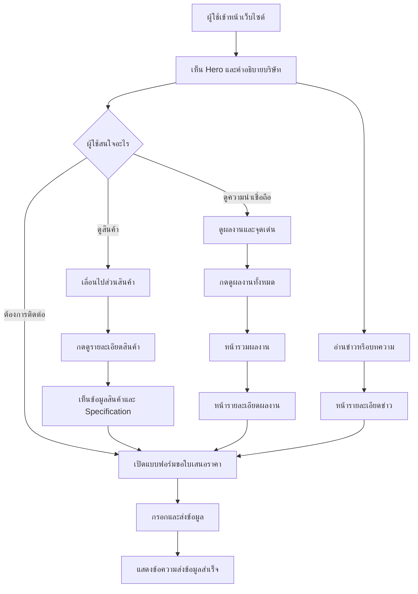
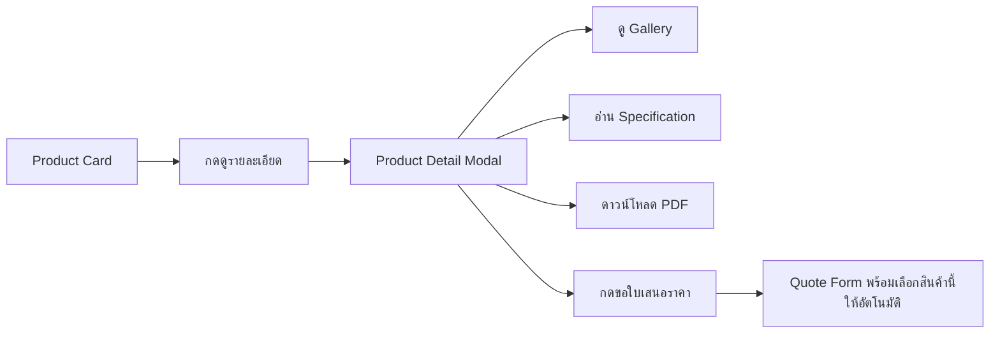

# Figma Website Design Guide  
## บริษัท ยักษ์ใหญ่ 2015 จำกัด

> เว็บไซต์บริษัทแบบ **One Page Landing Page + Dynamic Portfolio + Dynamic News**
>
> เอกสารนี้ใช้เป็นแนวทางสำหรับออกแบบใน Figma และส่งต่อให้ Developer เข้าใจโครงสร้างเว็บไซต์ การนำทาง พฤติกรรมของปุ่ม และข้อมูลที่ผู้ใช้จะเห็นในแต่ละจุด

---

# 1. แนวคิดของเว็บไซต์

## เป้าหมายหลัก

เว็บไซต์ต้องช่วยให้ผู้เข้าชมเข้าใจภายในเวลาไม่นานว่า:

1. บริษัททำธุรกิจอะไร
2. มีเครื่องจักรและบริการอะไรบ้าง
3. ระบบเหมาะกับโรงงานประเภทใด
4. บริษัทเคยทำผลงานอะไรมาแล้ว
5. สามารถติดต่อหรือขอใบเสนอราคาได้อย่างไร

## รูปแบบเว็บไซต์

เว็บไซต์หลักยังคงเป็น **One Page Landing Page** แต่เพิ่มหน้ารองสำหรับข้อมูลที่มีการอัปเดตบ่อย ได้แก่:

- หน้ารวมผลงาน
- หน้ารายละเอียดผลงาน
- หน้ารวมข่าวสาร
- หน้ารายละเอียดข่าวสาร
- หน้านโยบายความเป็นส่วนตัว
- ระบบหลังบ้านสำหรับเพิ่มข่าวและผลงาน

รูปแบบนี้ทำให้หน้าแรกไม่ยาวเกินไป และแต่ละผลงานหรือบทความสามารถแชร์ลิงก์และค้นหาผ่าน Google ได้

---

# 2. Theme Direction

## ชื่อแนวทาง

**Industrial Biomass Engineering**

ภาพรวมควรสื่อถึง:

- งานวิศวกรรม
- เครื่องจักรอุตสาหกรรม
- พลังงานชีวมวล
- ความน่าเชื่อถือ
- การให้บริการครบวงจร
- ความแข็งแรงแต่ไม่ดูเก่า

## Mood & Tone

- Professional
- Industrial
- Reliable
- Engineering-focused
- Clean
- Modern
- Environmentally responsible

---

# 3. Color System

## สีหลักที่แนะนำ

| Token | สี | Hex | การใช้งาน |
|---|---|---:|---|
| Primary 900 | เขียวอุตสาหกรรมเข้ม | `#143D32` | Header, Footer, Hero overlay |
| Primary 700 | เขียวชีวมวล | `#246B50` | ปุ่มหลัก, Icon, Highlight |
| Primary 500 | เขียวกลาง | `#3E8B68` | Hover, Badge, Decorative elements |
| Accent 600 | ส้มพลังงาน | `#D97706` | CTA สำคัญ, ตัวเลข, Status |
| Accent 400 | ส้มอ่อน | `#F59E0B` | Hover และ Highlight |
| Neutral 950 | ดำเทา | `#17201C` | Heading |
| Neutral 700 | เทาเข้ม | `#46524C` | Body text |
| Neutral 300 | เทาเส้นขอบ | `#D9E0DC` | Border, Divider |
| Neutral 100 | เทาอ่อน | `#F2F5F3` | Section background |
| White | ขาว | `#FFFFFF` | Card และพื้นหลังหลัก |

## สัดส่วนการใช้สี

```text
60%  White / Light Gray
25%  Dark Green / Biomass Green
10%  Charcoal Text
5%   Energy Orange
```

สีส้มควรใช้เฉพาะจุดที่ต้องการให้ผู้ใช้ดำเนินการ เช่น:

- ขอใบเสนอราคา
- โทรหาเรา
- ดูรายละเอียด
- ตัวเลขผลลัพธ์
- Badge สำคัญ

ไม่ควรใช้สีส้มเป็นพื้นหลังขนาดใหญ่ เพราะจะทำให้เว็บดูคล้ายบริษัทก่อสร้างทั่วไปเกินไป

## Semantic Colors

| สถานะ | Hex |
|---|---:|
| Success | `#15803D` |
| Warning | `#D97706` |
| Error | `#B91C1C` |
| Information | `#2563EB` |

---

# 4. Typography

## ฟอนต์

### Heading

- Kanit
- Weight: 500, 600, 700

### Body

- Noto Sans Thai หรือ Sarabun
- Weight: 400, 500, 600

## Typography Scale

| Style | Desktop | Mobile | Weight |
|---|---:|---:|---:|
| Display | 56 px | 38 px | 700 |
| H1 | 48 px | 34 px | 700 |
| H2 | 36 px | 28 px | 600 |
| H3 | 26 px | 22 px | 600 |
| H4 | 20 px | 18 px | 600 |
| Body Large | 18 px | 17 px | 400 |
| Body | 16 px | 16 px | 400 |
| Small | 14 px | 14 px | 400 |
| Caption | 12 px | 12 px | 500 |

## Line Height

- Heading: 120–135%
- Body: 155–175%

---

# 5. Layout System

## Desktop

- Frame: 1440 px
- Content maximum width: 1200 px
- Grid: 12 Columns
- Gutter: 24 px
- Side margin: 80–120 px

## Tablet

- Frame: 768 px
- Grid: 8 Columns
- Side margin: 32 px

## Mobile

- Frame: 390 px
- Grid: 4 Columns
- Side margin: 20 px
- Gutter: 16 px

## Spacing Scale

```text
4 / 8 / 12 / 16 / 24 / 32 / 40 / 48 / 64 / 80 / 96 / 120
```

## Border Radius

| Component | Radius |
|---|---:|
| Button | 8 px |
| Input | 8 px |
| Card | 12–16 px |
| Image | 12 px |
| Modal | 16–20 px |
| Pill / Badge | 999 px |

---

# 6. Website Architecture

```text
/
├── Landing Page
│   ├── Hero
│   ├── About
│   ├── Products
│   ├── Industries
│   ├── Services
│   ├── Why Us
│   ├── Featured Projects
│   ├── Latest News
│   ├── Downloads
│   ├── Quote CTA
│   └── Contact
│
├── /projects
│   └── หน้ารวมผลงานทั้งหมด
│
├── /projects/[slug]
│   └── หน้ารายละเอียดผลงาน
│
├── /news
│   └── หน้ารวมข่าวสารและบทความ
│
├── /news/[slug]
│   └── หน้ารายละเอียดข่าวหรือบทความ
│
├── /privacy-policy
│   └── นโยบายความเป็นส่วนตัว
│
└── /admin
    ├── Dashboard
    ├── Portfolio Management
    ├── News Management
    ├── Product Management
    ├── Download Management
    ├── Contact Messages
    └── Website Settings
```

---

# 7. Main Navigation

## Desktop Header

```text
[Logo]

หน้าแรก
เกี่ยวกับเรา
สินค้า
บริการ
ผลงาน
ข่าวสาร
ติดต่อเรา

[ขอใบเสนอราคา]
```

## พฤติกรรมของเมนู

| ผู้ใช้กด | ระบบทำอะไร |
|---|---|
| หน้าแรก | เลื่อนไป Hero |
| เกี่ยวกับเรา | Smooth Scroll ไป About |
| สินค้า | Smooth Scroll ไป Products |
| บริการ | Smooth Scroll ไป Services |
| ผลงาน | เปิด `/projects` หรือเลื่อนไป Featured Projects |
| ข่าวสาร | เปิด `/news` |
| ติดต่อเรา | Smooth Scroll ไป Contact |
| ขอใบเสนอราคา | เปิด Quote Form Modal หรือเลื่อนไป Quote Form |

## Sticky Header

เมื่อผู้ใช้เลื่อนหน้า:

- Header เปลี่ยนจากโปร่งใสเป็นพื้นสีขาว
- เพิ่ม Shadow บาง ๆ
- Logo ใช้เวอร์ชันสีเข้ม
- ปุ่มขอใบเสนอราคายังคงมองเห็นชัดเจน

## Mobile Header

```text
[Logo]                           [Menu]
```

เมื่อกด Menu:

```text
หน้าแรก
เกี่ยวกับเรา
สินค้า
บริการ
ผลงาน
ข่าวสาร
ติดต่อเรา

[ขอใบเสนอราคา]
[โทรหาเรา]
[LINE]
```

---

# 8. Global User Flow



---

# 9. Landing Page Structure

# Section 01 — Hero

## เป้าหมาย

บอกทันทีว่าบริษัททำอะไร และสร้างเส้นทางไปยังการขอใบเสนอราคา

## Layout

### Desktop

```text
----------------------------------------------------------
| Header                                                   |
----------------------------------------------------------
|                                                         |
|  Label: Industrial Biomass Solution                     |
|                                                         |
|  ระบบเตาแก๊สซิไฟเออร์และเครื่องจักร                    |
|  อบแห้งสำหรับโรงงานอุตสาหกรรม                          |
|                                                         |
|  ออกแบบ ผลิต ติดตั้ง และทดสอบระบบ                      |
|  ให้เหมาะกับกระบวนการผลิตของแต่ละโรงงาน                |
|                                                         |
|  [ขอใบเสนอราคา] [ดูสินค้าและบริการ]                     |
|                                                         |
|  ✓ ออกแบบตามหน้างาน  ✓ ติดตั้งครบวงจร                 |
|                                                         |
|                         ภาพ/วิดีโอเครื่องจักร            |
----------------------------------------------------------
```

### Mobile

- ข้อความอยู่ด้านบน
- ภาพอยู่ด้านล่าง
- CTA เรียงแนวตั้ง
- ปุ่มหลักเต็มความกว้าง

## ผู้ใช้กดอะไรได้บ้าง

### ขอใบเสนอราคา

เปิด Modal หรือเลื่อนไปยังฟอร์ม โดยแสดงฟิลด์:

- ชื่อผู้ติดต่อ
- บริษัท
- เบอร์โทร
- LINE หรือ Email
- ประเภทโรงงาน
- ระบบที่สนใจ
- รายละเอียดเบื้องต้น

### ดูสินค้าและบริการ

Smooth Scroll ไป Products

### เล่นวิดีโอ

เปิด Lightbox Video และหยุดวิดีโอเมื่อปิด

---

# Section 02 — Trust Bar

แสดงจุดเด่นแบบสั้นทันทีหลัง Hero

```text
ออกแบบตามความต้องการ
ผลิตและติดตั้งครบวงจร
ทดสอบก่อนส่งมอบ
บริการหลังการขาย
```

ควรใช้ Icon เส้นเรียบ ไม่ใช้ภาพ Icon หลายสี

---

# Section 03 — About Company

## Layout

```text
[ภาพโรงงานหรือทีมงาน]     [หัวข้อเกี่ยวกับบริษัท]
                          [คำอธิบาย 2–3 ย่อหน้า]
                          [ข้อมูลเด่น]
                          [ดูข้อมูลบริษัท]
```

## ข้อมูลที่เห็น

- บริษัททำอะไร
- ให้บริการใครบ้าง
- รูปแบบการทำงาน
- แนวคิดด้านการลดต้นทุนพลังงาน

## ปุ่ม

### ดูข้อมูลบริษัท

ในเวอร์ชัน One Page ให้เลื่อนไปจุดเด่นหรือแสดงรายละเอียดเพิ่มด้วย Accordion

หากข้อมูลบริษัทมีมากภายหลัง สามารถเพิ่มหน้า `/about` ได้

---

# Section 04 — Products

## หัวข้อ

**ระบบและเครื่องจักรที่ออกแบบตามการใช้งานจริง**

## Product Cards

### Card 1

- เตาแก๊สซิไฟเออร์ 1.5 MW
- เหมาะกับโรงงานอุตสาหกรรมขนาดใหญ่
- รูปสินค้า
- จุดเด่น 2–3 ข้อ
- ปุ่มดูรายละเอียด
- ปุ่มขอใบเสนอราคา

### Card 2

- เตาแก๊สซิไฟเออร์ 750 kW
- เหมาะกับ SME และโรงงานขนาดกลาง
- รูปสินค้า
- จุดเด่น 2–3 ข้อ
- ปุ่มดูรายละเอียด
- ปุ่มขอใบเสนอราคา

### Card 3

- Cassava Pulp Rotary Dryer
- ระบบอบกากแป้งมันสำปะหลัง
- รูปสินค้า
- จุดเด่น 2–3 ข้อ
- ปุ่มดูรายละเอียด
- ปุ่มขอใบเสนอราคา

## เมื่อกดดูรายละเอียด

แนะนำให้เปิด Product Detail Drawer หรือ Modal ขนาดใหญ่

ผู้ใช้จะเห็น:

```text
ชื่อสินค้า
ภาพ Gallery
คำอธิบาย
เหมาะกับโรงงานประเภทใด
จุดเด่น
หลักการทำงาน
Specification
เชื้อเพลิงหรือวัตถุดิบที่รองรับ
ตัวอย่างโครงการ
ไฟล์ดาวน์โหลด
ปุ่มขอใบเสนอราคา
```

## Product Modal Flow



---

# Section 05 — Industries

## เป้าหมาย

ทำให้ผู้ใช้รู้ว่าระบบเหมาะกับธุรกิจของตัวเองหรือไม่

## Layout

ใช้ Grid 3–4 คอลัมน์

```text
โรงงานอบปุ๋ย
โรงงานอบแร่
โรงงานมันสำปะหลัง
โรงงานอบทราย
โรงงานอบยิปซัม
โรงงานแปรรูปผลผลิตทางการเกษตร
โรงงานที่ต้องการเปลี่ยนจาก LPG
ผู้ประกอบการ SME
```

## Interaction

เมื่อ Hover:

- Card ยกขึ้นเล็กน้อย
- Icon เปลี่ยนเป็นสีส้ม
- แสดงคำอธิบายสั้น ๆ

ไม่จำเป็นต้องคลิกทุก Card หากยังไม่มีหน้ารายละเอียดของอุตสาหกรรม

---

# Section 06 — Services & Process

## รูปแบบ

ใช้ Process Timeline เพื่อสื่อว่าบริษัทดูแลครบวงจร

```text
01 ให้คำปรึกษา
02 สำรวจและเก็บข้อมูล
03 ออกแบบระบบ
04 ผลิตเครื่องจักร
05 ติดตั้ง
06 ทดสอบและอบรม
07 บริการหลังการขาย
```

## Desktop

แสดงเป็น Timeline แนวนอนหรือ Zigzag

## Mobile

แสดงเป็น Timeline แนวตั้ง

## เมื่อกดแต่ละขั้นตอน

แสดงรายละเอียดสั้น ๆ ใต้ขั้นตอน หรือเปิด Accordion

ตัวอย่าง:

### ออกแบบระบบ

> วิเคราะห์ชนิดเชื้อเพลิง ปริมาณความร้อน พื้นที่ติดตั้ง และข้อจำกัดของกระบวนการผลิตก่อนออกแบบระบบ

---

# Section 07 — Why Choose Us

## Layout

ใช้ Card 4 ใบ

```text
ออกแบบเฉพาะโครงการ
ให้คำปรึกษาก่อนเริ่มงาน
ติดตั้งพร้อมทดสอบจริง
ดูแลหลังการขาย
```

แต่ละ Card ประกอบด้วย:

- Icon
- หัวข้อ
- คำอธิบาย 2 บรรทัด
- ตัวเลขหรือหลักฐาน ถ้ามี

ห้ามใส่ตัวเลขสมมุติในเว็บไซต์จริง

---

# Section 08 — Featured Projects

## เป้าหมาย

สร้างความน่าเชื่อถือด้วยผลงานจริง

## หน้าแรกแสดง

- 3–6 ผลงานล่าสุดหรือผลงานเด่น
- รูปหน้าปก
- ชื่อโครงการ
- ประเภทโรงงาน
- จังหวัด
- ระบบที่ติดตั้ง
- ปุ่มดูรายละเอียด

## Layout

Desktop:

```text
[Project ใหญ่ 1 ใบ] [Project 2]
                     [Project 3]
```

หรือ Grid 3 คอลัมน์

Mobile:

- Card เรียงแนวตั้ง
- รูปอัตราส่วน 4:3
- ปุ่มเต็มความกว้าง

## ปุ่มดูผลงานทั้งหมด

เปิด `/projects`

---

# 10. Projects List Page

## URL

```text
/projects
```

## สิ่งที่ผู้ใช้เห็น

```text
Breadcrumb
หน้าแรก / ผลงาน

หัวข้อ: ผลงานของเรา
คำอธิบาย

[ค้นหาผลงาน]
[ตัวกรองประเภทระบบ]
[ตัวกรองประเภทโรงงาน]
[ตัวกรองจังหวัด]

Project Grid
Pagination หรือ Load More
CTA ขอใบเสนอราคา
Footer
```

## Project Card

```text
รูปหน้าปก
ประเภทโครงการ
ชื่อโครงการ
จังหวัด
ปีที่ติดตั้ง
ระบบที่ติดตั้ง
[ดูรายละเอียด]
```

## Filter Interaction

เมื่อผู้ใช้เลือกประเภท:

- Project Grid อัปเดต
- URL สามารถเพิ่ม Query Parameter
- มีปุ่มล้างตัวกรอง
- Mobile เปิด Filter Bottom Sheet

---

# 11. Project Detail Page

## URL

```text
/projects/project-name
```

## สิ่งที่ผู้ใช้เห็น

```text
Breadcrumb
Project Hero
Project Overview
Problem / Requirement
Designed Solution
Scope of Work
Installation Process
Gallery
Project Result
Related Product
Related Projects
Quote CTA
Footer
```

## Project Hero

แสดง:

- ชื่อโครงการ
- จังหวัด
- ประเภทโรงงาน
- ปีที่ติดตั้ง
- ระบบที่ติดตั้ง
- ภาพหลัก

## Project Overview

ใช้ Information Grid:

| รายการ | ข้อมูล |
|---|---|
| ลูกค้าหรือประเภทโรงงาน | ข้อมูลที่เปิดเผยได้ |
| จังหวัด | จังหวัด |
| ระบบที่ติดตั้ง | รุ่นสินค้า |
| ขนาดระบบ | kW หรือ MW |
| ปีที่ติดตั้ง | ปี |
| ขอบเขตงาน | ออกแบบ/ผลิต/ติดตั้ง |

## Gallery

เมื่อกดรูป:

- เปิด Fullscreen Lightbox
- เลื่อนไปภาพถัดไปได้
- รองรับ Caption
- กด Esc เพื่อปิดบน Desktop
- Swipe บน Mobile

## CTA

ปุ่ม:

- สนใจระบบลักษณะนี้
- ขอใบเสนอราคา
- โทรปรึกษาทีมงาน

เมื่อกดขอใบเสนอราคา ระบบแนบชื่อโครงการอ้างอิงในฟอร์มให้อัตโนมัติ

---

# Section 09 — Latest News

## หน้าแรกแสดง

- ข่าวหรือบทความล่าสุด 3 รายการ
- รูปหน้าปก
- หมวดหมู่
- ชื่อบทความ
- วันที่เผยแพร่
- คำอธิบายสั้น
- ปุ่มอ่านเพิ่มเติม

## ประเภทเนื้อหา

- ความรู้เรื่อง Biomass
- วิธีลดต้นทุนเชื้อเพลิง
- เปรียบเทียบ LPG กับ Gasifier
- ข่าวติดตั้งเครื่องจักร
- ข่าวกิจกรรมบริษัท
- การบำรุงรักษาระบบ

## ปุ่มดูข่าวสารทั้งหมด

เปิด `/news`

---

# 12. News List Page

## URL

```text
/news
```

## สิ่งที่ผู้ใช้เห็น

```text
Breadcrumb
หัวข้อข่าวสารและบทความ
Featured Article
Category Filter
Article Grid
Pagination
Newsletter หรือ Contact CTA
Footer
```

## Category Filter

- ทั้งหมด
- ความรู้
- เครื่องจักร
- พลังงานชีวมวล
- ผลงานติดตั้ง
- ข่าวบริษัท

---

# 13. News Detail Page

## URL

```text
/news/article-name
```

## สิ่งที่ผู้ใช้เห็น

```text
Breadcrumb
หมวดหมู่
หัวข้อข่าว
วันที่เผยแพร่
ผู้เขียน
ภาพหน้าปก
สารบัญ
เนื้อหาบทความ
ภาพประกอบ
ไฟล์ดาวน์โหลด
แชร์บทความ
บทความที่เกี่ยวข้อง
Contact CTA
```

## Interaction

- สารบัญกดแล้วเลื่อนไปหัวข้อ
- ปุ่มแชร์เปิด Facebook, LINE หรือคัดลอกลิงก์
- รูปภาพเปิด Lightbox
- ปุ่มติดต่อท้ายบทความเปิด Quote Form

---

# Section 10 — Downloads

## รูปแบบ

แสดงเป็น Compact Cards

```text
Company Profile
Product Catalog
Gasifier Specification
Rotary Dryer Specification
Brochure
```

แต่ละ Card มี:

- ชื่อไฟล์
- ประเภทไฟล์
- ขนาดไฟล์
- วันที่อัปเดต
- ปุ่มดาวน์โหลด

## Interaction

เมื่อกดดาวน์โหลด:

- เปิด PDF ใน Tab ใหม่ หรือเริ่ม Download
- ระบบสามารถบันทึกจำนวนการดาวน์โหลด
- ถ้าไฟล์ไม่มี ให้ซ่อนรายการ ไม่แสดงปุ่มเสีย

---

# Section 11 — Quote CTA

## รูปแบบ

พื้นหลังเขียวเข้ม พร้อมภาพเครื่องจักรแบบโปร่ง

```text
กำลังมองหาระบบผลิตความร้อน
ที่เหมาะกับโรงงานของคุณ?

ส่งรายละเอียดเบื้องต้นให้ทีมงานช่วยประเมินระบบ

[ขอใบเสนอราคา] [โทรปรึกษา] [LINE]
```

## ปุ่มขอใบเสนอราคา

เปิด Quote Form

## ปุ่มโทรปรึกษา

บนมือถือเปิดแอปโทรศัพท์  
บน Desktop แสดงหมายเลขและปุ่มคัดลอก

## ปุ่ม LINE

เปิด LINE OA หรือ LINE Contact

---

# Section 12 — Contact

## Desktop Layout

```text
[ข้อมูลติดต่อ]          [แบบฟอร์ม]
[ที่อยู่]
[โทรศัพท์]
[Email]
[LINE]
[Facebook]

[Google Maps เต็มความกว้าง]
```

## แบบฟอร์มติดต่อ

### Field

- ชื่อ
- ชื่อบริษัท
- เบอร์โทร
- Email หรือ LINE
- หัวข้อที่สนใจ
- ข้อความ
- Checkbox ยอมรับนโยบายความเป็นส่วนตัว
- ปุ่มส่งข้อมูล

## Form States

### Default

แสดงฟอร์มพร้อมคำอธิบาย

### Validation Error

- Border สีแดง
- ข้อความอธิบายใต้ Field
- Focus ไปที่ Field แรกที่ผิด

### Loading

- ปุ่มเปลี่ยนเป็น “กำลังส่ง...”
- ปิดการกดซ้ำ

### Success

```text
ส่งข้อมูลเรียบร้อยแล้ว
ทีมงานจะติดต่อกลับตามช่องทางที่คุณให้ไว้
```

### Error

```text
ไม่สามารถส่งข้อมูลได้
กรุณาลองใหม่หรือติดต่อผ่านโทรศัพท์หรือ LINE
```

---

# 14. Footer

## Column 1

- Logo
- คำอธิบายบริษัทสั้น ๆ
- Social Media

## Column 2

- หน้าแรก
- เกี่ยวกับเรา
- สินค้า
- บริการ

## Column 3

- ผลงาน
- ข่าวสาร
- ดาวน์โหลด
- ติดต่อเรา

## Column 4

- ที่อยู่
- เบอร์โทร
- Email
- เวลาทำการ

## Bottom Bar

- Copyright
- Privacy Policy
- Cookie Policy
- Terms ถ้ามี

---

# 15. Floating Actions

## Desktop

ด้านขวาล่าง:

```text
[LINE]
[โทร]
[ขอใบเสนอราคา]
```

## Mobile

ใช้ Bottom Sticky Bar:

```text
[โทรหาเรา] [LINE] [ขอใบเสนอราคา]
```

ต้องระวังไม่ให้บังเนื้อหาและ Cookie Banner

---

# 16. CMS Architecture

## Dashboard

ผู้ดูแลเห็น:

- จำนวนผลงานทั้งหมด
- จำนวนข่าวทั้งหมด
- ข้อความติดต่อใหม่
- Draft ที่ยังไม่เผยแพร่
- ข่าวล่าสุด
- ผลงานล่าสุด

---

# 17. CMS — Portfolio Management

## Portfolio List

```text
ค้นหา
กรองสถานะ
กรองประเภท
[เพิ่มผลงานใหม่]

ตาราง:
รูป
ชื่อผลงาน
ประเภทโรงงาน
จังหวัด
วันที่อัปเดต
สถานะ
Action
```

## Action

- แก้ไข
- Preview
- Publish / Unpublish
- Duplicate
- Delete

## Add/Edit Portfolio

### Basic Information

- ชื่อผลงาน
- Slug
- คำอธิบายสั้น
- ประเภทโรงงาน
- จังหวัด
- ปีที่ติดตั้ง
- สถานะ

### Project Details

- ปัญหาของลูกค้า
- แนวทางแก้ไข
- ขอบเขตงาน
- ขั้นตอนการติดตั้ง
- ผลลัพธ์
- ขนาดระบบ
- สินค้าที่เกี่ยวข้อง

### Media

- ภาพหน้าปก
- Gallery
- Video URL
- Alt Text
- Caption

### SEO

- SEO Title
- Meta Description
- Social Image
- Canonical URL

### Publishing

- Draft
- Scheduled
- Published
- Featured on Homepage

---

# 18. CMS — News Management

## News List

- ค้นหา
- กรองหมวดหมู่
- กรองสถานะ
- เพิ่มข่าวใหม่

## Add/Edit News

### Basic

- หัวข้อ
- Slug
- หมวดหมู่
- คำอธิบายสั้น
- ผู้เขียน
- วันที่เผยแพร่

### Content

- Rich Text Editor
- Heading
- Paragraph
- Image
- Video
- Quote
- Table
- Download File

### Media

- Cover Image
- Gallery
- Alt Text
- Caption

### SEO

- SEO Title
- Meta Description
- Social Image
- Structured Data Fields

### Publishing

- Draft
- Scheduled
- Published
- Featured on Homepage

---

# 19. CMS — Contact Messages

ผู้ดูแลเห็น:

- ชื่อผู้ติดต่อ
- บริษัท
- เบอร์โทร
- Email / LINE
- หัวข้อ
- วันที่
- สถานะ

## Status

- New
- Contacted
- In Progress
- Closed
- Spam

## Detail

- ข้อความเต็ม
- สินค้าที่สนใจ
- หน้าเว็บไซต์ที่ส่งฟอร์ม
- วันที่และเวลา
- หมายเหตุภายใน

---

# 20. Component List for Figma

## Navigation

- Desktop Header
- Sticky Header
- Mobile Header
- Mobile Drawer
- Breadcrumb

## Buttons

- Primary Button
- Secondary Button
- Ghost Button
- Icon Button
- Text Link
- Loading Button
- Disabled Button

## Cards

- Product Card
- Project Card
- Article Card
- Service Card
- Industry Card
- Download Card
- Statistic Card

## Forms

- Text Input
- Phone Input
- Email Input
- Select
- Textarea
- Checkbox
- File Upload
- Validation Message
- Success Message

## Media

- Image Gallery
- Video Player
- Lightbox
- Thumbnail
- Image Placeholder

## Feedback

- Toast
- Modal
- Confirmation Dialog
- Empty State
- Loading Skeleton
- Error State

## CMS

- Sidebar
- Top Bar
- Data Table
- Status Badge
- Pagination
- Rich Text Editor
- Media Uploader
- Publish Panel

---

# 21. Button Behavior Matrix

| ปุ่ม | ปลายทางหรือผลลัพธ์ |
|---|---|
| ขอใบเสนอราคา | เปิด Quote Form |
| ดูสินค้า | Scroll ไป Products |
| ดูรายละเอียดสินค้า | เปิด Product Modal |
| ดูผลงานทั้งหมด | เปิด `/projects` |
| ดูรายละเอียดผลงาน | เปิด `/projects/[slug]` |
| ดูข่าวสารทั้งหมด | เปิด `/news` |
| อ่านเพิ่มเติม | เปิด `/news/[slug]` |
| ดาวน์โหลด | เปิดหรือดาวน์โหลดไฟล์ |
| โทรหาเรา | เปิด `tel:` บนมือถือ |
| LINE | เปิด LINE OA |
| Facebook | เปิด Facebook Page |
| Google Maps | เปิดพิกัดใน Google Maps |
| ส่งข้อความ | Validate และ Submit Form |
| กลับหน้าแรก | เปิด `/` |
| แชร์บทความ | เปิด Share Menu |
| เพิ่มผลงาน | เปิด CMS Editor |
| Publish | เผยแพร่เนื้อหา |
| Preview | เปิดหน้าตัวอย่างก่อนเผยแพร่ |

---

# 22. Figma File Structure

```text
00 — Cover
01 — Project Brief
02 — Sitemap & User Flow
03 — Design Tokens
04 — Components
05 — Landing Desktop
06 — Landing Mobile
07 — Product Modal
08 — Project List
09 — Project Detail
10 — News List
11 — News Detail
12 — Contact & Quote Form
13 — CMS Dashboard
14 — CMS Portfolio
15 — CMS News
16 — CMS Contact Messages
17 — Prototype
18 — Developer Handoff
```

---

# 23. Frames to Design

## Public Website

- Landing Desktop 1440
- Landing Mobile 390
- Product Modal Desktop
- Product Modal Mobile
- Project List Desktop
- Project List Mobile
- Project Detail Desktop
- Project Detail Mobile
- News List Desktop
- News List Mobile
- News Detail Desktop
- News Detail Mobile
- Quote Form
- Contact Success
- 404 Page
- Privacy Policy

## CMS

- Login
- Dashboard
- Portfolio List
- Add Portfolio
- Edit Portfolio
- News List
- Add News
- Contact Messages
- Settings
- Mobile CMS Optional

---

# 24. Prototype Connections

## Landing Prototype

```text
Hero CTA
→ Quote Modal
→ Submit
→ Success State

Product Card
→ Product Modal
→ Quote Modal with selected product

Featured Project
→ Project Detail

View All Projects
→ Project List
→ Filter
→ Project Detail

Latest News
→ News Detail
→ Related Article

Contact
→ Google Maps / Phone / LINE
```

## CMS Prototype

```text
Login
→ Dashboard
→ Portfolio List
→ Add Portfolio
→ Preview
→ Publish
→ Public Project Detail

Dashboard
→ News List
→ Add News
→ Schedule
→ Public News Detail
```

---

# 25. Responsive Behavior

## Header

- Desktop แสดงเมนูทั้งหมด
- Tablet ลดจำนวนเมนู
- Mobile ใช้ Drawer

## Hero

- Desktop 2 Columns
- Mobile 1 Column

## Product Cards

- Desktop 3 Columns
- Tablet 2 Columns
- Mobile 1 Column

## Project Cards

- Desktop 3 Columns
- Tablet 2 Columns
- Mobile 1 Column

## Forms

- Desktop 2 Columnsในบางส่วน
- Mobile 1 Columnทั้งหมด

## Tables

ใน CMS บน Mobile:

- เปลี่ยนเป็น Card List
- Action อยู่ใน More Menu

---

# 26. Accessibility

- ข้อความต้องมี Contrast เพียงพอ
- ปุ่มมีขนาดกดอย่างน้อย 44 × 44 px
- Focus State ต้องมองเห็น
- รูปภาพทุกภาพมี Alt Text
- Form มี Label ชัดเจน
- ไม่ใช้สีเพียงอย่างเดียวในการแสดงสถานะ
- Modal ต้องกด Esc เพื่อปิดได้
- รองรับ Keyboard Navigation
- Video ควรมี Caption หากมีเสียงบรรยาย

---

# 27. Content Required From Client

## Company

- โลโก้
- ชื่อภาษาอังกฤษ
- สโลแกน
- ประวัติบริษัท
- วิสัยทัศน์
- ปีที่ก่อตั้ง
- ใบรับรองหรือมาตรฐาน

## Product

- Specification ของแต่ละรุ่น
- เชื้อเพลิงที่รองรับ
- ขนาดเครื่อง
- พื้นที่ติดตั้ง
- ระบบควบคุม
- ระยะเวลาผลิต
- การรับประกัน

## Project

- ชื่อโครงการ
- จังหวัด
- ประเภทโรงงาน
- ปีที่ติดตั้ง
- ระบบที่ติดตั้ง
- ปัญหาก่อนติดตั้ง
- ผลลัพธ์หลังติดตั้ง
- สิทธิ์ใช้รูปภาพและชื่อบริษัทลูกค้า

## Contact

- ที่อยู่
- เบอร์โทร
- Email
- LINE
- Facebook
- Google Maps
- เวลาทำการ

## Documents

- Company Profile
- Catalog
- Brochure
- Product Specification

---

# 28. Recommended Design Direction Summary

## ใช้

- พื้นหลังขาวและเทาอ่อน
- เขียวเข้มเป็นสีแบรนด์
- ส้มเป็นสี CTA
- รูปเครื่องจักรจริง
- Layout กว้างและมีพื้นที่ว่าง
- Typography ชัด
- Card เรียบ
- Animation เล็กน้อย

## หลีกเลี่ยง

- Gradient หลายสี
- Icon หลายสไตล์
- Shadow หนา
- Animation มากเกินไป
- ข้อความวางทับภาพโดยไม่มี Overlay
- การใช้สีส้มเต็มหน้า
- Card จำนวนมากจนทุก Section ดูเหมือนกัน
- Stock Photo ที่ไม่เกี่ยวกับผลงานจริง

---

# 29. Suggested Animation

- Hero text fade up
- ภาพเครื่องจักรเคลื่อนไหวช้าแบบ subtle zoom
- Card ขยับขึ้น 4–8 px ตอน Hover
- Timeline แสดงทีละขั้นตอนเมื่อ Scroll
- Number counter ใช้เฉพาะข้อมูลจริง
- Gallery fade transition
- Sticky CTA ปรากฏหลังเลื่อนพ้น Hero

ระยะเวลา Animation แนะนำ:

```text
Fast: 150 ms
Normal: 250 ms
Slow: 400–600 ms
```

---

# 30. Final Design Principle

ผู้ใช้ควรสามารถเดินทางจาก:

```text
รู้จักบริษัท
→ เห็นสินค้า
→ ตรวจสอบความน่าเชื่อถือ
→ อ่านผลงาน
→ เข้าใจบริการ
→ ติดต่อหรือขอใบเสนอราคา
```

ได้โดยไม่ต้องเดาว่าควรกดตรงไหน

ทุกหน้าควรมี CTA ที่ชัดเจนอย่างน้อยหนึ่งจุด และทุกหน้ารายละเอียดควรพาผู้ใช้กลับไปยัง:

- ขอใบเสนอราคา
- โทรหาเรา
- ติดต่อ LINE
- ดูผลงานหรือสินค้าที่เกี่ยวข้อง
